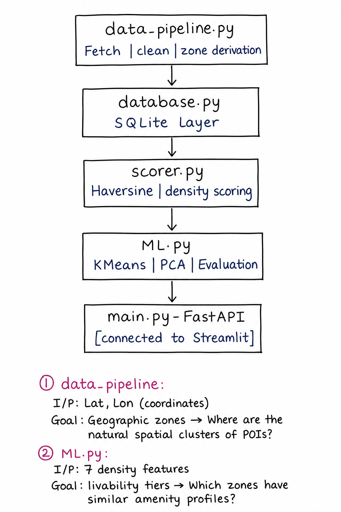
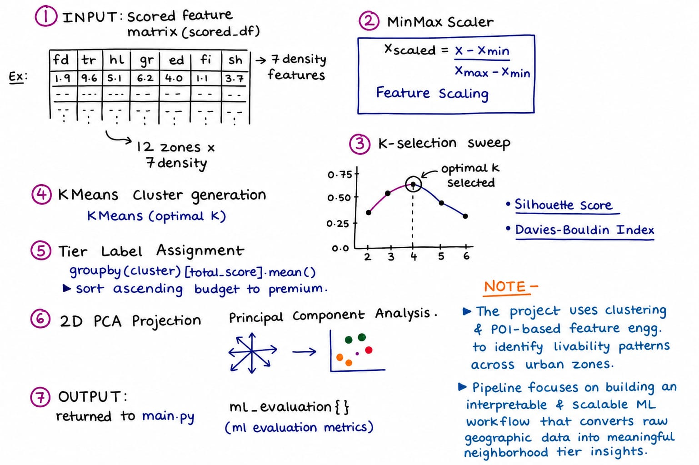
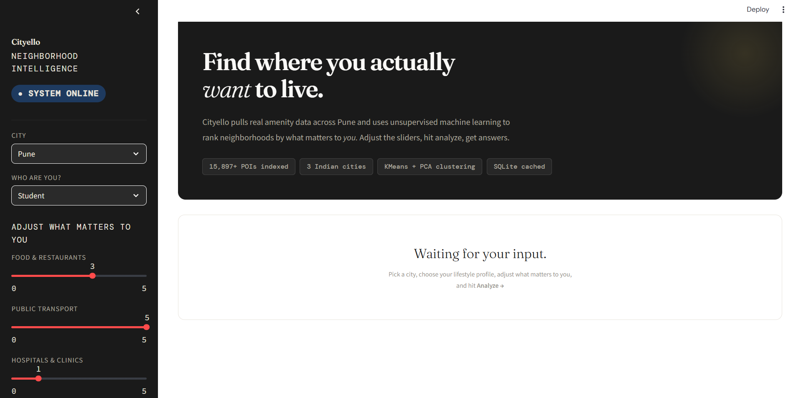
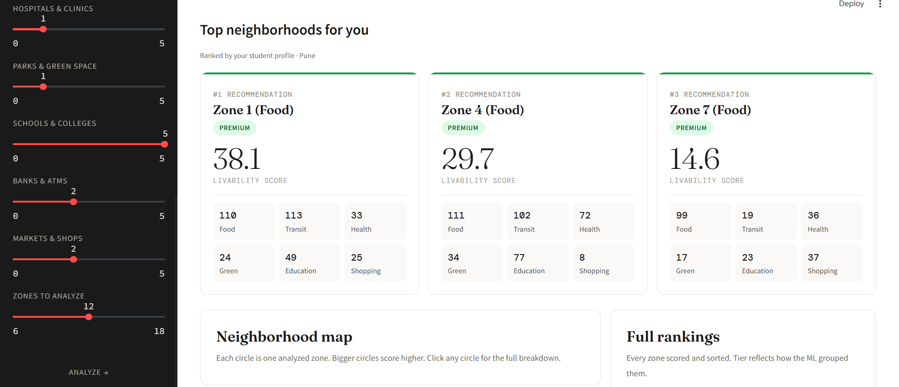
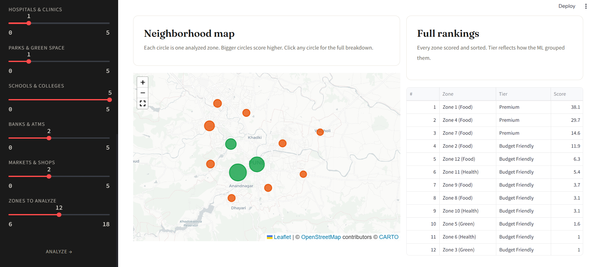
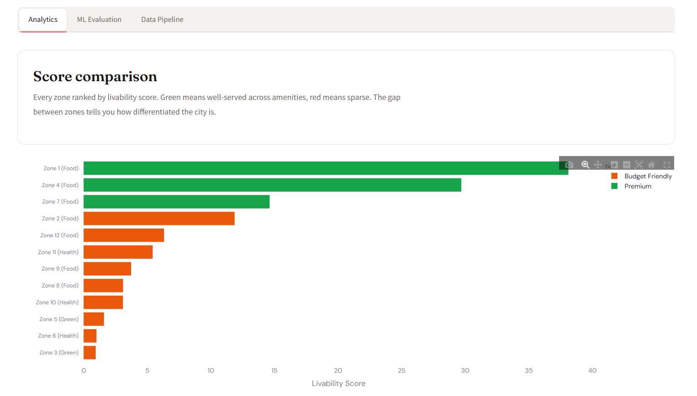
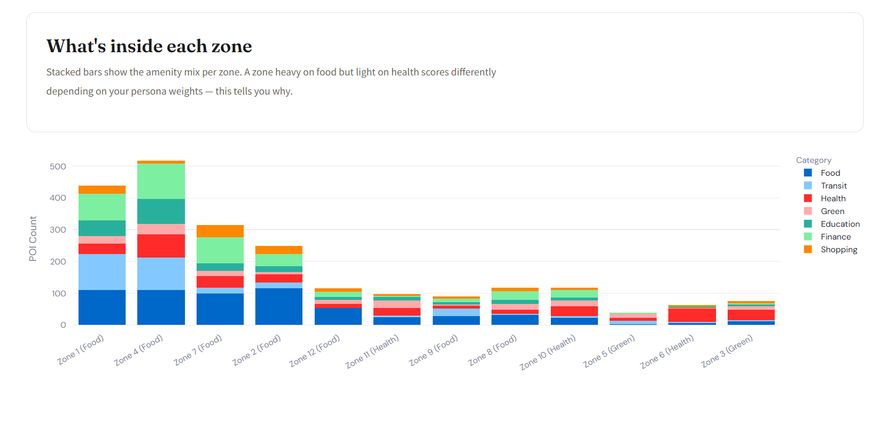
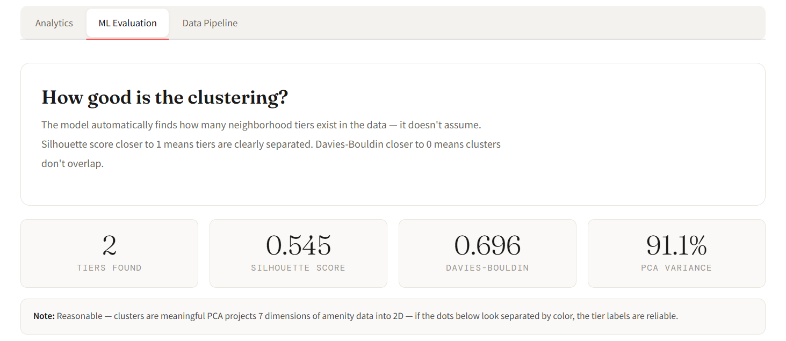
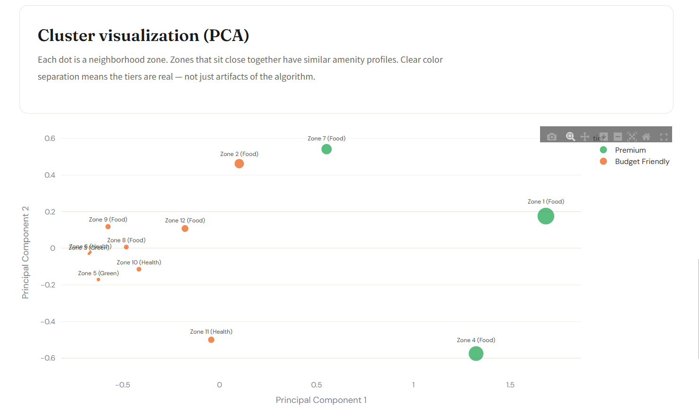

# Cityello 🍁

### Urban Neighborhood livability analytics for Indian cities.
> 15,8000+ POI's | across 3 cities (Pune, Banglore, Mumbai)

"Which neighborhood should I live in?" is one of the most consequential decisions a person makes, and the only available answers are word-of-mouth and listings from people with a financial interest in your choice. I wanted to see what an honest, data-driven answer looks like.

Cityello fetches real geospatial data across a city, scores every zone by how well it serves daily life, and uses unsupervised machine learning to surface livability tiers. The results change depending on who you are — a student, a family, a working professional, because the same city means something different to each.

<!-- BADGES -->
<div align="center">


</div>

---

## The problem with "walkability scores"

Most neighborhood scoring tools give you a single number. That number is computed from assumptions baked into the tool — assumptions about what matters and how much.

Cityello exposes those assumptions as user-controlled weights. You decide what a good neighborhood means. The pipeline scores it accordingly.

There is a second, less obvious problem: raw amenity counts are misleading. Eight restaurants in 0.5 km² and eight restaurants in 5 km² are not the same neighborhood. The scoring layer normalizes by zone area [**POIs per km², not raw count**] — so the model reflects density, not just presence.

---

## Stack

Python 3.11 | FastAPI | SQLite | scikit-learn | pandas | NumPy | Pydantic | SlowAPI | Streamlit | Plotly | Folium | Geoapify (OpenStreetMap)

---

## Architecture

<p align="center">
  
</p>

The pipeline is intentionally linear and unidirectional. Data flows one way, each stage owns exactly one responsibility, and no stage knows what comes after it.

`data_pipeline` comes first because everything downstream is meaningless without clean, validated data. Garbage in, garbage tiers out. Cleaning and zone derivation happen here before any scoring logic runs. This means the scorer never has to defend itself against bad input.

`database` sits between fetching and scoring. Persisting at this point means the 15-second cold fetch happens once per city per day, and every subsequent request — regardless of persona or weight configuration — skips it entirely.

`scorer` comes before the ML because the ML should never see raw coordinates or raw API responses. By the time data reaches `ml.py`, it is already a clean numeric feature matrix. 

`main.py` is last because the API is a delivery mechanism. Routing, validation, and error handling are its only concerns. The pipeline it calls is already correct by the time it touches it.

This is a modular structure.

---

## What the ML actually does

The model clusters neighborhoods by amenity density profile — not by location, not by total score.

►  Two zones with identical total scores but different compositions will not necessarily land in the same tier. A zone high on food and transit but low on health is a different kind of neighborhood than one high on health and education. KMeans on 7-dimensional density vectors captures this nuance. A single ranking number hides it.

►  The number of tiers is not preset. The pipeline sweeps K from 2 to 6, selects the value that maximizes silhouette score, then validates with the Davies-Bouldin index. The system tells you how confident it is in those tiers — and if the answer is "not very," it says so explicitly rather than presenting uncertain results with equal confidence.

<p align="center">
  
</p>

---

## Migrated to SQLite

The previous version wrote cleaned POI data to a JSON file on disk. It worked until it didn't: no schema, no duplicate protection, no concurrent access safety.

SQLite costs nothing to run, requires no infrastructure, and gives real database guarantees. `UNIQUE` constraints prevent duplicate POIs regardless of how many times the same city is fetched. WAL mode allows reads during writes. A deterministic weights hash enables per-configuration result caching so the full scoring and clustering pipeline only runs once per unique weight combination.

The scores cache table is designed and implemented. It is not yet connected to the API endpoint. That is the next commit.

---

## Persona system

Three presets encode genuinely different optimization functions over the same amenity space.

👩‍🎓 A **Student** without a car in an Indian city lives by transit access and campus proximity. 
👨‍👩‍👧‍👦 A **Family** places hospitals and schools above everything else. 
👩‍⚕️ A **Working Professional** optimizes for food, commute, and financial services. Users can also adjust any weight manually between 0 and 5.

Same city. Same data. Same pipeline. Different inputs, different rankings  ►  each locally correct for its intended user.

---

## Try it!

<p align="center">
  
</p>

---

<p align="center">
  
</p>

---

<p align="center">
  
</p>

---

<p align="center">
  
</p>

<p align="center">
  
</p>

---

<p align="center">
  
</p>

<p align="center">
  
</p>

---

## Running it

```bash
# create virtual environment
python -m venv venv

# activate venv (Windows)
venv\Scripts\activate

# backend setup
cd backend
pip install -r requirements.txt

# add API key
echo GEOAPIFY_API_KEY=your_key > .env

# start FastAPI server
uvicorn main:app --reload --port 8000

# < open new terminal >

# activate venv again
venv\Scripts\activate

# frontend setup
cd frontend
streamlit run app.py
```

First request per city: 40-50 seconds (live fetch).
Every request after that, within 24 hours: under one second (SQLite cache).

API docs at `http://localhost:8000/docs`.

---

## Known gaps & planned improvements

The 15 Geoapify calls in `fetch_all_pois` are sequential and synchronous. The 24-hour cache means most requests never hit this path — but for the ones that do, `aiohttp` with `asyncio.gather()` is the correct solution.

OSM data quality is uneven across Indian cities. Central neighborhoods are well-mapped. Peripheral areas are not. This is a systematic bias the current system does not measure or correct for.

The `/db/clear/{city}` endpoint has no authentication. Anyone who finds the URL can delete a city's data. A header API key is the fix. It is not there yet.

`init_db()` runs at module import time. If the database path is not writable, the application crashes before starting rather than failing gracefully. This belongs in a FastAPI lifespan handler.

---

*Built by Anagha Chaudhari*
